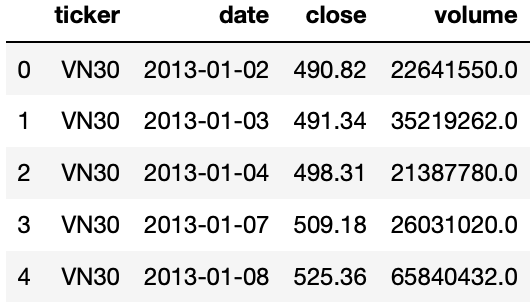
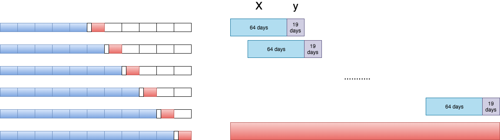

# DELAFO : DeEp Learning Approach for portFolio Optimization
## Applications

#### Predict the optimized portfolio (based on Sharpe ratio) in future
    Formulate the portfolio optimization as a supervise problem.
    With input is the past event(Default is price and volume of market in 64 days ago).
    Predict the tickers should be in our portfolios in future . Evaluate by the Sharpe ratio (Default is next 19 working days~ around one next month).
    All the tickers have same proportion in this portfolio.
    The number of tickers will be constrainted by the constraint_value in loss function.

## Training
#### All the data will be preprocessed before using to train our models.(preprocess_data.py)
    * with input is the past event(price and volume of market in 64 days ago).
    * predict the future tickers should be in our portfolios. (next 19 working days~ around one next month).


## Usage:
Firstly, you need to download data and put it in `data` folder, you can download from [Link download data from Entropy Contest 2019](https://drive.google.com/file/d/1IwUwxzctgagNipWLBfuqCUAfmkXVyeXC/view?usp=sharing).
```bash
$ python main.py --data_path path/to/data --model model/name --load_pretrained True/False --model_path '' --timesteps_input time/window/input --timesteps_input time/window/output
```
### --data_path: path to dataset.
### --load_pretrained: Bool value. True if you want to load pretrained model. Default False
### --model_path : if --load_pretrained == True . You have to specify the `path` to pretrained model.
### --model_name : all available models at the moment are:
 * ['ResNet' , 'GRU' , 'LSTM' , 'AA_GRU' , 'AA_LSTM' , 'SA_GRU' , 'SA_LSTM'] with corresponding configuration file in `config` folder.
  RNN model with attention mechanism.
  <p align="center">
     </p>
     <p align="center">ResNet model.(b) is the first residual block. (c) is the architecture of second and third blocks. (d) is the final block. <p align="center">

<p align="center">
   </p>
   <p align="center">Additive Attention with RNN model<p align="center">

<p align="center">
   </p>
   <p align="center">Self Attention with RNN model<p align="center">

 * You can change the configuration of these models by changing the config file in config folder (We do not recommend to do it, because these hyperparameters had been tuned for these models).
 * You can design your own model by put it in `models` folder.

### --timesteps_input : time window for the input.
### --timesteps_input : time window for the output.
## DATA
  * Must be in csv file.
  * Now all the models just support for data have 4 fields ['ticker','date','price','volume'] like in picture:
  

## Training:

 We do the ForWard Chain to train and evaluate the models like picture below:
 <p align="center">
    </p>
    <p align="center">Forward Chain. The Blue block is training data, the Red block is evaluating data.<p align="center">
    
## Requirement:
 * python          3.6.2
 * scikit-learn    0.21.3
 * Keras           2.3.1
 * pandas          0.25.1
 * tensorflow      1.13.2
